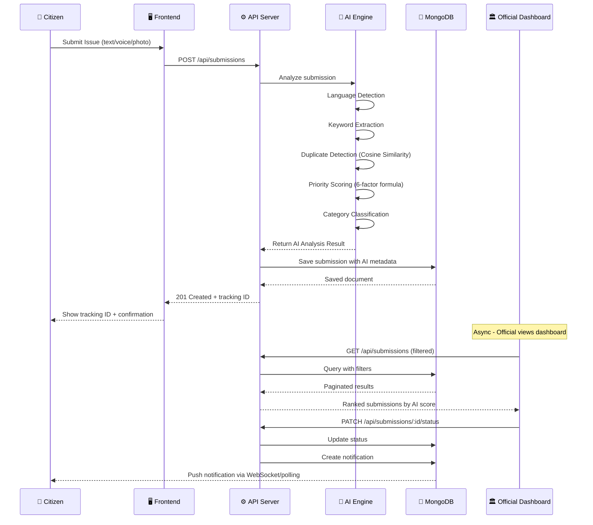
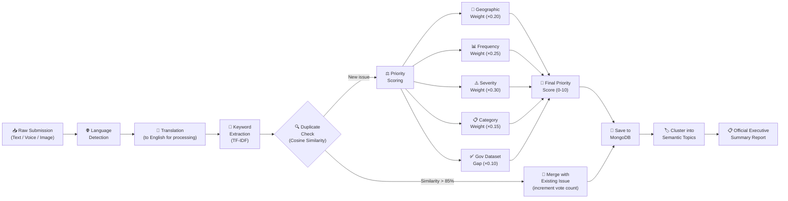
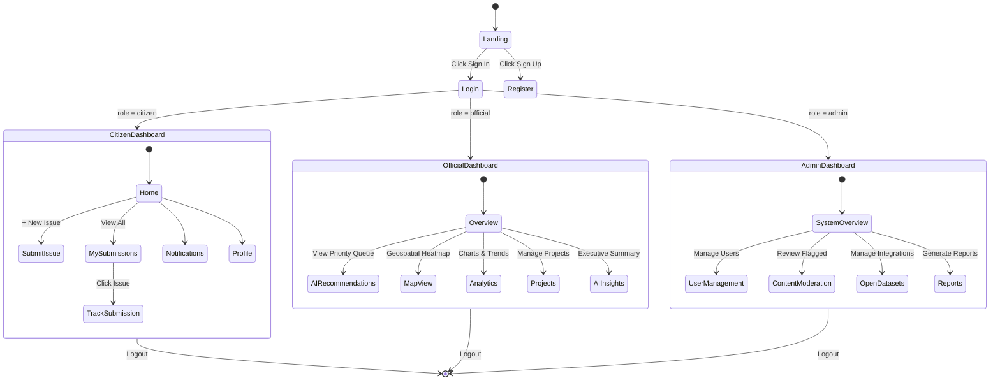
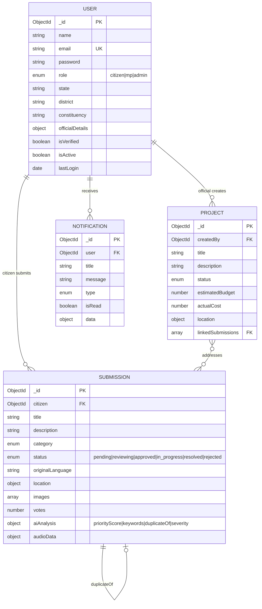
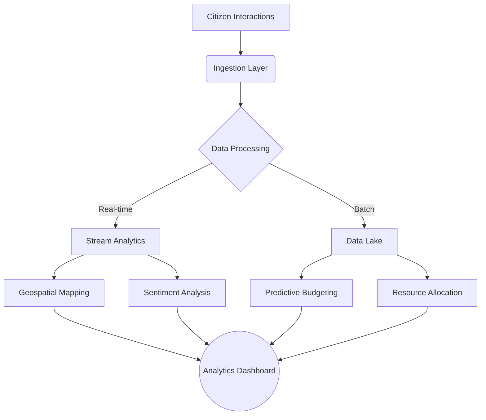

<div align="center">


# 🏛️ JanVikas AI

### AI-Powered Multilingual Development Intelligence Platform for Government Officials

[](https://reactjs.org)
[](https://vitejs.dev)
[](https://nodejs.org)
[](https://mongodb.com/atlas)
[](https://tailwindcss.com)
[](https://opensource.org/licenses/MIT)

</div>

---

## 📋 Table of Contents

- [Problem Statement](#-problem-statement)
- [Solution](#-solution)
- [System Architecture](#-system-architecture)
- [Data Flow](#-data-flow)
- [AI Pipeline](#-ai-pipeline)
- [User Roles & Flows](#-user-roles--flows)
- [Database Schema](#-database-schema)
- [Features](#-features)
- [Tech Stack](#-tech-stack)
- [Folder Structure](#-folder-structure)
- [Quick Start](#-quick-start)
- [Demo Credentials](#-demo-credentials)
- [API Routes](#-api-routes)
- [Future Scope](#-future-scope)

---

## 🚨 Problem Statement

Government Officials receive **thousands of development requests** every month through WhatsApp, emails, grievance portals, direct meetings, and social media — with no intelligent system to organize, prioritize, or act on them.

**The 5 Critical Gaps:**

| Gap | Current State | Impact |
|-----|--------------|--------|
| Data Silos | Issues in 10+ different channels | No unified view |
| Duplicates | Same road request submitted 100+ times | Wasted processing |
| Language Barrier | Requests in 12+ Indian languages | Misinterpretation |
| No Prioritization | Manual and subjective | Poor resource allocation |
| No Accountability | Zero tracking after submission | Citizen distrust |

---

## 💡 Solution

**JanVikas AI** — a production-ready, AI-powered platform that acts as the **intelligence layer** between citizens and their government officials.

```
CITIZEN PROBLEM → AI PROCESSING → OFFICIAL ACTION → CITIZEN RESOLUTION
```

---

## 🏗️ System Architecture

```mermaid
graph TB
    subgraph CLIENT["🌐 Client Layer (React + Vite)"]
        LANDING[Landing Page]
        AUTH[Auth Pages]
        CITIZEN_UI[Citizen Dashboard]
        OFFICIAL_UI[Official Dashboard]
        ADMIN_UI[Admin Dashboard]
    end

    subgraph BACKEND["⚙️ Backend Layer (Node.js + Express)"]
        API[REST API Server :5000]
        AUTH_MW[JWT Middleware]
        RATE[Rate Limiter]
        VALID[Input Validator]
        
        subgraph ROUTES["API Routes"]
            R_AUTH[/api/auth]
            R_SUB[/api/submissions]
            R_PROJ[/api/projects]
            R_AI[/api/ai]
            R_ANALYTICS[/api/analytics]
        end
        
        subgraph CONTROLLERS["Controllers"]
            C_AUTH[authController]
            C_SUB[submissionController]
            C_PROJ[projectController]
            C_AI[aiController]
        end
    end

    subgraph AI_ENGINE["🧠 AI Engine (Algorithmic)"]
        NLP[NLP Processor]
        DEDUP[Duplicate Detector]
        PRIORITY[Priority Scorer]
        CLUSTER[Semantic Clusterer]
        SUMMARY[Executive Summarizer]
    end

    subgraph DATA["💾 Data Layer"]
        MONGO[(MongoDB Atlas)]
        FIREBASE[(Firebase Storage)]
    end

    CLIENT --> API
    API --> AUTH_MW
    AUTH_MW --> ROUTES
    ROUTES --> CONTROLLERS
    CONTROLLERS --> AI_ENGINE
    CONTROLLERS --> DATA
    AI_ENGINE --> DATA
```

---

## 🔄 Data Flow



---

## 🧠 AI Pipeline



---

## 👥 User Roles & Flows



---

## 🗄️ Database Schema



---

## ✨ Features

### 👤 Citizen Module
| Feature | Description |
|---------|-------------|
| 🎤 Voice Submission | Speech-to-text issue filing in Indian languages |
| 📍 Geo-tagging | Auto-detect location for spatial mapping |
| 🖼️ Photo Upload | Firebase-backed image storage for evidence |
| 🔍 Issue Tracker | Real-time status updates with timeline |
| 🔔 Smart Notifications | Instant alerts when Official acts on issues |
| 🌐 12 Languages | Full UI & submission support for all major Indian languages |

### 🏛️ Official Module
| Feature | Description |
|---------|-------------|
| 🧠 AI Recommendations | Priority-scored queue of actionable issues |
| 🗺️ Geospatial Heatmap | Leaflet map with clustered issue markers |
| 📊 Analytics Dashboard | Recharts-powered trend analysis |
| 🔍 Duplicate Detection | AI-merged duplicate submissions with vote counts |
| 📋 Executive Summary | LLM-style AI-generated weekly/monthly reports |
| 📁 Project Manager | Full CRUD project management linked to submissions |

### 🛡️ Admin Module
| Feature | Description |
|---------|-------------|
| 👥 User Management | Activate/deactivate citizens & MPs |
| 🚫 Content Moderation | AI + manual review of flagged content |
| 🗃️ Open Datasets | Integrate government data (PMGSY, JJM, SBM) |
| 📈 System Reports | National-level analytics and CSV exports |
| ⚙️ National Oversight | Cross-constituency project monitoring |

---

## 🛠️ Tech Stack

### Frontend
```
React 18 + Vite 5          →  Fast HMR dev server
TailwindCSS 3              →  Utility-first styling
Framer Motion              →  Smooth page/component animations
React Router v6            →  Client-side routing with role guards
React Hook Form            →  Form state & validation
Recharts                   →  Analytics charts
React Leaflet              →  Interactive geospatial maps
Axios                      →  HTTP client with JWT interceptors
react-hot-toast            →  Toast notifications
Lucide React               →  Icon library
```

### Backend
```
Node.js 20 + Express 5     →  REST API server
Mongoose 8                 →  MongoDB ODM with schema validation
bcryptjs                   →  Password hashing (12 salt rounds)
jsonwebtoken               →  JWT auth (7d expiry)
express-rate-limit         →  DDoS protection
express-validator          →  Input sanitization
helmet                     →  HTTP security headers
morgan                     →  HTTP request logging
compression                →  Response compression
```

### Database & Storage
```
MongoDB Atlas              →  Cloud NoSQL database (geospatial index)
Firebase Storage           →  Image & audio file storage
```

---

## 📁 Folder Structure

```
JanVikas-Ai/
├── frontend/
│   ├── src/
│   │   ├── components/
│   │   │   └── common/          # Navbar, Sidebar, ThemeToggle, LoadingSpinner
│   │   ├── context/             # AuthContext, ThemeContext, NotificationContext
│   │   ├── hooks/               # useAuth, useTheme, useGeolocation, usePagination
│   │   ├── layouts/             # MainLayout, DashboardLayout, AuthLayout
│   │   ├── pages/
│   │   │   ├── auth/            # Login, Register, ForgotPassword
│   │   │   ├── citizen/         # Dashboard, Submit, Track, Profile, Notifications
│   │   │   ├── official/        # Dashboard, Analytics, Map, Projects, AIInsights
│   │   │   └── admin/           # Dashboard, Users, Moderation, Reports, Datasets
│   │   ├── routes/              # AppRoutes, ProtectedRoute, RoleRoute
│   │   ├── services/            # api.js, authService, submissionService, aiService...
│   │   ├── styles/              # index.css (Tailwind + CSS variables)
│   │   └── utils/               # helpers.js, formatters.js
│   ├── tailwind.config.js
│   └── vite.config.js
│
└── backend/
    ├── config/                  # db.js (MongoDB), firebase.js
    ├── controllers/             # authController, submissionController, aiController...
    ├── middlewares/             # auth.js (JWT), rateLimiter, validate, errorHandler
    ├── models/                  # User, Submission, Project, Notification
    ├── routes/                  # auth, submissions, projects, analytics, ai, users
    ├── services/                # aiService (priority engine, dedup, clustering)
    ├── utils/                   # helpers.js, logger.js
    ├── validators/              # authValidator, submissionValidator
    └── server.js
```

---

## 🚀 Quick Start

### Prerequisites
- Node.js 18+
- MongoDB Atlas account (free tier works)
- Git

### 1. Clone the Repository
```bash
git clone https://github.com/your-repo/JanVikas-Ai.git
cd JanVikas-Ai
```

### 2. Setup Backend
```bash
cd backend
npm install
cp .env.example .env    # Fill in your MongoDB URI and JWT secret
npm run dev             # Starts on http://localhost:5000
```

### 3. Seed Demo Data
```bash
cd backend
node fix-seeds.js       # Creates the 3 demo users with hashed passwords
```

### 4. Setup Frontend
```bash
cd frontend
npm install
npm run dev             # Starts on http://localhost:5173
```

---

## 🔑 Demo Credentials

> ⚡ On the Login page, click the colored buttons to **auto-fill** demo credentials instantly!

| Role | Email | Password | Access |
|------|-------|----------|--------|
| 🏠 **Citizen** | `citizen@test.com` | `Password123` | Submit & track issues |
| 🏛️ **Official** | `official@test.com` | `Password123` | Full Official dashboard + AI insights |
| 🛡️ **Admin** | `admin@test.com` | `Password123` | System-wide administration |

---

## 📈 Analytics & Big Data Architecture



---

## 🌐 API Routes

### Auth
| Method | Endpoint | Description |
|--------|----------|-------------|
| POST | `/api/auth/register` | Register new user |
| POST | `/api/auth/login` | Login & get JWT token |
| GET | `/api/auth/me` | Get current user (protected) |
| PUT | `/api/auth/profile` | Update profile (protected) |
| PUT | `/api/auth/change-password` | Change password (protected) |

### Submissions
| Method | Endpoint | Description |
|--------|----------|-------------|
| POST | `/api/submissions` | Create new submission |
| GET | `/api/submissions` | Get all submissions (filtered) |
| GET | `/api/submissions/:id` | Get single submission |
| PATCH | `/api/submissions/:id/status` | Update status (MP/Admin) |
| POST | `/api/submissions/:id/vote` | Upvote a submission |
| GET | `/api/submissions/map` | Get geo-coordinates for map |

### AI
| Method | Endpoint | Description |
|--------|----------|-------------|
| GET | `/api/ai/recommendations` | AI-ranked priority queue for MP |
| GET | `/api/ai/duplicates` | Detected duplicate clusters |
| GET | `/api/ai/summary` | Executive summary for district |
| GET | `/api/ai/clusters` | Semantic topic clusters |

### Analytics
| Method | Endpoint | Description |
|--------|----------|-------------|
| GET | `/api/analytics/overview` | KPI stats for dashboard |
| GET | `/api/analytics/trends` | Monthly trend data |
| GET | `/api/analytics/categories` | Category breakdown |

---

## 🔮 Future Scope

```mermaid
roadmap
    title JanVikas AI Roadmap
    section Phase 1 - Current (MVP)
        Citizen submission portal          : done, 2024-01, 2024-03
        AI priority engine                 : done, 2024-02, 2024-03
        Official dashboard + analytics     : done, 2024-02, 2024-04
        Admin panel                        : done, 2024-03, 2024-04
    section Phase 2 - Enhancement
        WhatsApp Bot integration           : 2024-05, 2024-06
        Real LLM integration (Gemini API)  : 2024-05, 2024-07
        Push notifications via FCM         : 2024-06, 2024-07
        Mobile app (React Native)          : 2024-06, 2024-08
    section Phase 3 - Scale
        Multi-constituency Official accounts : 2024-09, 2024-10
        Government API integration (Data.gov.in) : 2024-09, 2024-11
        Blockchain audit trail             : 2024-10, 2024-12
        National deployment                : 2024-11, 2025-01
```

---

## 🤝 Contributing

1. Fork the repository
2. Create your feature branch (`git checkout -b feature/AmazingFeature`)
3. Commit your changes (`git commit -m 'Add some AmazingFeature'`)
4. Push to the branch (`git push origin feature/AmazingFeature`)
5. Open a Pull Request

---

## 📄 License

Distributed under the MIT License. See `LICENSE` for more information.

---

<div align="center">
  Made with ❤️ for India's Democracy
  
  <br/>
  
  **JanVikas AI** — *Empowering the Voice of Every Citizen*
</div>
