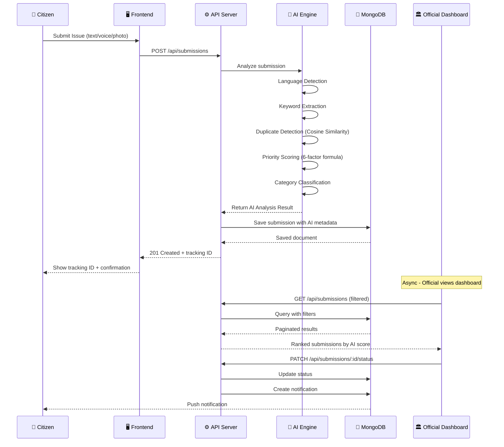
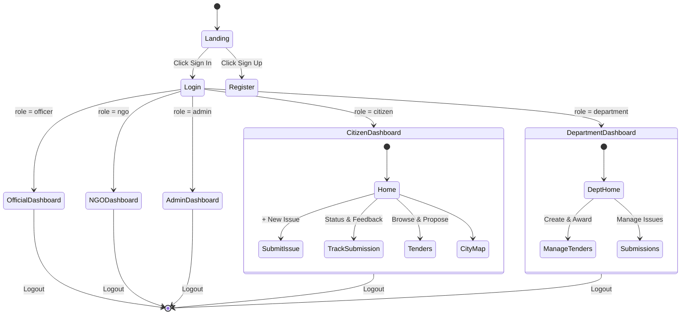
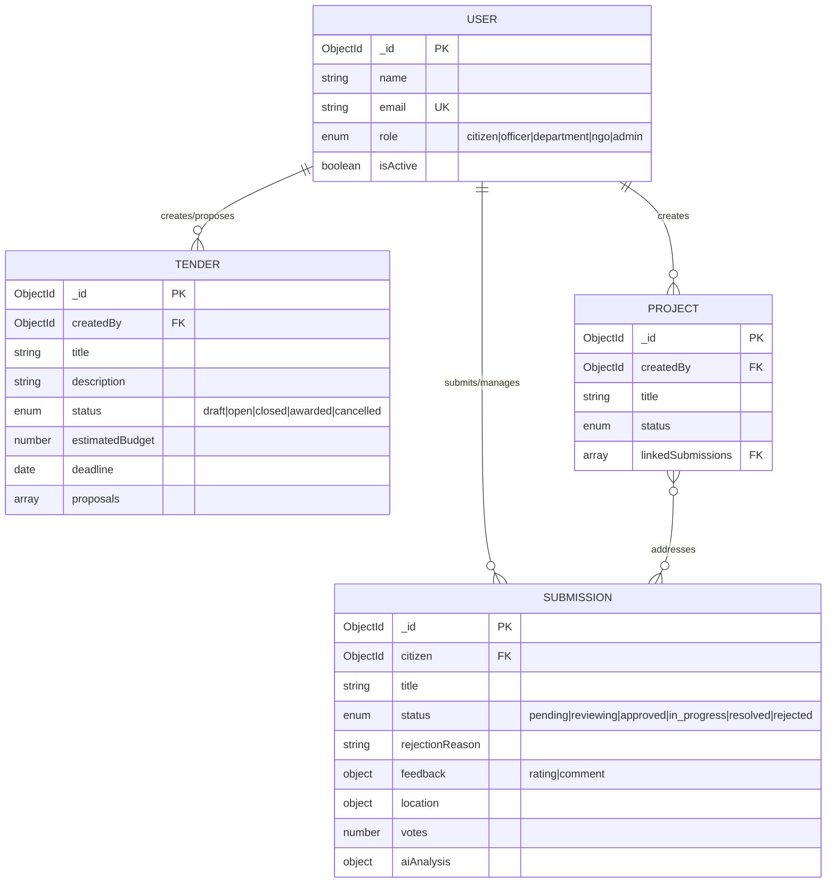

<div align="center">


# 🏛️ JanVikas AI

### AI-Powered Multilingual Development Intelligence Platform for Government Officials

[](https://reactjs.org)
[](https://vitejs.dev)
[](https://nodejs.org)
[](https://mongodb.com/atlas)
[](https://tailwindcss.com)
[](https://opensource.org/licenses/MIT)

</div>

---

## 📋 Table of Contents

- [Problem Statement](#-problem-statement)
- [Solution](#-solution)
- [System Architecture](#-system-architecture)
- [Data Flow](#-data-flow)
- [AI Pipeline](#-ai-pipeline)
- [User Roles & Flows](#-user-roles--flows)
- [Database Schema](#-database-schema)
- [Features](#-features)
- [Tech Stack](#-tech-stack)
- [Folder Structure](#-folder-structure)
- [Quick Start](#-quick-start)
- [Demo Credentials](#-demo-credentials)
- [API Routes](#-api-routes)
- [Future Scope](#-future-scope)

---

## 🚨 Problem Statement

Government Officials receive **thousands of development requests** every month through WhatsApp, emails, grievance portals, direct meetings, and social media — with no intelligent system to organize, prioritize, or act on them.

**The 5 Critical Gaps:**

| Gap | Current State | Impact |
|-----|--------------|--------|
| Data Silos | Issues in 10+ different channels | No unified view |
| Duplicates | Same road request submitted 100+ times | Wasted processing |
| Language Barrier | Requests in 12+ Indian languages | Misinterpretation |
| No Prioritization | Manual and subjective | Poor resource allocation |
| No Accountability | Zero tracking after submission | Citizen distrust |

---

## 💡 Solution

**JanVikas AI** — a production-ready, AI-powered platform that acts as the **intelligence layer** between citizens, NGOs, and their government officials.

```
CITIZEN PROBLEM → AI PROCESSING → OFFICIAL ACTION → CITIZEN RESOLUTION & FEEDBACK
```

---

## 🏗️ System Architecture

```mermaid
graph TB
    subgraph CLIENT["🌐 Client Layer (React + Vite)"]
        LANDING[Landing Page]
        AUTH[Auth Pages]
        CITIZEN_UI[Citizen Dashboard]
        OFFICIAL_UI[Officer Dashboard]
        DEPT_UI[Department Dashboard]
        NGO_UI[NGO Dashboard]
        ADMIN_UI[Admin Dashboard]
    end

    subgraph BACKEND["⚙️ Backend Layer (Node.js + Express)"]
        API[REST API Server :5000]
        AUTH_MW[JWT Middleware]
        RATE[Rate Limiter]
        
        subgraph ROUTES["API Routes"]
            R_AUTH[/api/auth]
            R_SUB[/api/submissions]
            R_PROJ[/api/projects]
            R_TENDER[/api/tenders]
            R_AI[/api/ai]
            R_ANALYTICS[/api/analytics]
        end
    end

    subgraph AI_ENGINE["🧠 AI Engine (Algorithmic)"]
        NLP[NLP Processor]
        DEDUP[Duplicate Detector]
        PRIORITY[Priority Scorer]
        CLUSTER[Semantic Clusterer]
    end

    subgraph DATA["💾 Data Layer"]
        MONGO[(MongoDB Atlas)]
        FIREBASE[(Firebase Storage)]
    end

    CLIENT --> API
    API --> AUTH_MW
    AUTH_MW --> ROUTES
    ROUTES --> AI_ENGINE
    ROUTES --> DATA
    AI_ENGINE --> DATA
```

---

## 🔄 Data Flow



---

## 👥 User Roles & Flows



---

## 🗄️ Database Schema



---

## ✨ Features

### 👤 Citizen Module
| Feature | Description |
|---------|-------------|
| 🎤 Voice Submission | Speech-to-text issue filing in Indian languages |
| 📍 City Complaint Map | Interactive Leaflet map displaying active complaints across the city |
| 🖼️ Submission Tracking | Animated status stepper tracking issues from Pending to Resolved |
| 💬 Issue Feedback | Citizens can rate (1-5 stars) and comment on resolved issues |
| 📋 Tender Proposals | Citizens can submit project proposals to open government tenders |

### 🏛️ Officer Module
| Feature | Description |
|---------|-------------|
| 🧠 AI Recommendations | Priority-scored queue of actionable issues |
| 🗺️ Geospatial Heatmap | Map with clustered issue markers |
| 🚫 Issue Rejection | Officers can reject invalid requests with an attached reason |
| 🔍 Duplicate Detection | AI-merged duplicate submissions with vote counts |
| 📁 Project Manager | Full CRUD project management linked to submissions |

### 🏢 Department Module
| Feature | Description |
|---------|-------------|
| 📜 Tender Management | Create and publish government tenders with specific eligibility (NGOs/Citizens) |
| ✅ Proposal Approval | Review incoming proposals from NGOs/Citizens and Shortlist or Award them |
| 📊 Analytics Dashboard | Recharts-powered trend analysis for department operations |

### 🛡️ Admin Module
| Feature | Description |
|---------|-------------|
| 👥 User Management | Activate/deactivate accounts (Shows dedicated "Account Disabled" screen on login) |
| 🚫 Content Moderation | Review flagged content |
| 📈 System Reports | Platform-wide analytics and CSV exports |

---

## 🛠️ Tech Stack

### Frontend
```
React 18 + Vite 5          →  Fast HMR dev server
TailwindCSS 3              →  Utility-first styling
Framer Motion              →  Smooth page/component animations
React Router v6            →  Client-side routing with role guards
React Hook Form            →  Form state & validation
React Leaflet              →  Interactive geospatial maps for complaints
Axios                      →  HTTP client with JWT interceptors
react-hot-toast            →  Toast notifications
Lucide React               →  Icon library
```

### Backend
```
Node.js 20 + Express 5     →  REST API server
Mongoose 8                 →  MongoDB ODM with schema validation
bcryptjs                   →  Password hashing (12 salt rounds)
jsonwebtoken               →  JWT auth (7d expiry)
express-rate-limit         →  DDoS protection
```

---

## 🚀 Quick Start

### Prerequisites
- Node.js 18+
- MongoDB Atlas account (free tier works)
- Git

### 1. Clone the Repository
```bash
git clone https://github.com/your-repo/JanVikas-Ai.git
cd JanVikas-Ai
```

### 2. Setup Backend
```bash
cd backend
npm install
cp .env.example .env    # Fill in your MongoDB URI, JWT secret, and other env vars
npm run dev             # Starts on http://localhost:5000
```

### 3. Seed Demo Data
```bash
cd backend
node seed-demo.js       # Creates the 5 demo users (Citizen, Officer, Department, NGO, Admin)
```

### 4. Setup Frontend
```bash
cd frontend
npm install
npm run dev             # Starts on http://localhost:5173
```

---

## 🔑 Demo Credentials

> ⚡ On the Login page, click the colored buttons to **auto-fill** demo credentials instantly!

| Role | Email | Password | Access |
|------|-------|----------|--------|
| 🏠 **Citizen** | `citizen@janvikas.ai` | `password123` | Submit issues, track status, propose to tenders |
| 🏛️ **Officer** | `officer@janvikas.ai` | `password123` | Dashboard, AI insights, map view |
| 🏢 **Department** | `dept@janvikas.ai` | `password123` | Create Tenders, manage proposals and projects |
| 🤝 **NGO** | `ngo@janvikas.ai` | `password123` | View map, submit tender proposals |
| 🛡️ **Admin** | `admin@janvikas.ai` | `password123` | System-wide administration |

---

## 🌐 API Routes

### Submissions
| Method | Endpoint | Description |
|--------|----------|-------------|
| POST | `/api/submissions` | Create new submission |
| GET | `/api/submissions/map` | Get geo-coordinates for city map |
| GET | `/api/submissions/:id` | Get single submission details |
| PUT | `/api/submissions/:id/status` | Update status + note/rejection reason |
| POST | `/api/submissions/:id/feedback` | Post citizen feedback on resolution |

### Tenders
| Method | Endpoint | Description |
|--------|----------|-------------|
| GET | `/api/tenders` | Get all open tenders |
| GET | `/api/tenders/latest` | Get latest open tenders for landing page |
| GET | `/api/tenders/department/mine` | Department manages their own tenders |
| POST | `/api/tenders` | Create new tender |
| POST | `/api/tenders/:id/propose` | Submit a proposal (NGO/Citizen) |
| PATCH | `/api/tenders/:id/proposals/:proposalId`| Award, Reject or Shortlist a proposal |

### Auth
| Method | Endpoint | Description |
|--------|----------|-------------|
| POST | `/api/auth/login` | Login (Returns `ACCOUNT_DISABLED` if inactive) |

---

<div align="center">
  Made with ❤️ for India's Democracy
  
  <br/>
  
  **JanVikas AI** — *Empowering the Voice of Every Citizen*
</div>
